# OpenShift

> Make sure the
> [prerequisites for Ondat](../prerequisites/_index.md) are
> satisfied before proceeding. Including the deployment of an etcd cluster and
> configuration of CRI-O PID limits.

> For OpenShift upgrades, refer to the
> [OpenShift platform page](../platforms/openshift.md#openshift-upgrades).

> If you have installed OpenShift in AWS ensure that the requisite ports are
> opened for the worker nodes' security group.

> Make sure to add a Ondat licence after installing.

Ondat v2 supports OpenShift v4. For more information, see the [OpenShift platform](../platforms/openshift.md) page.



{}

# OperatorHub


{{ $version := .Get "sched_version" }}
{{ $platform := .Get "platform" }}


1. Select the `OperatorHub` from the Catalog sub menu and search for Ondat

    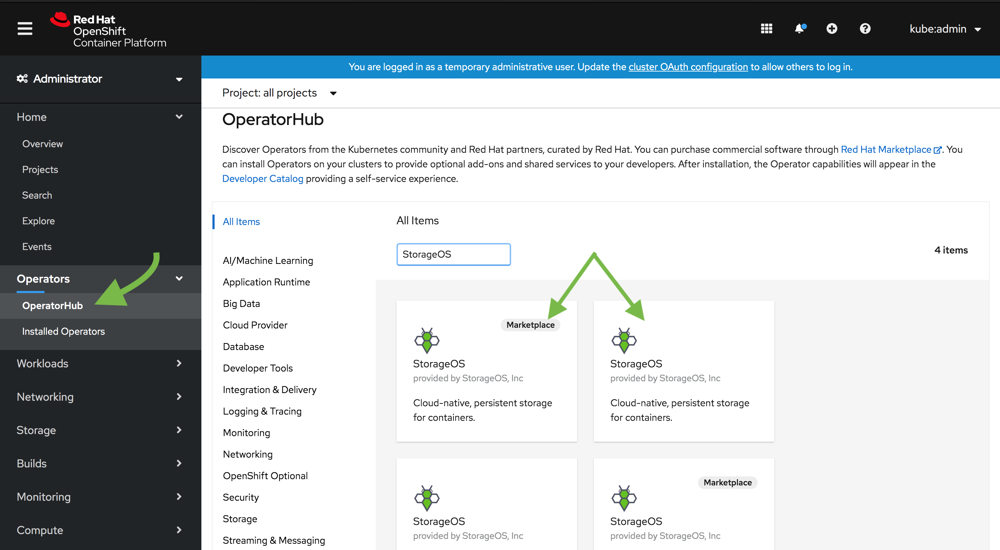

   > Choose between using the RedHat Market Place or the Community Operators
   > installation.

1. Select Ondat and click install

    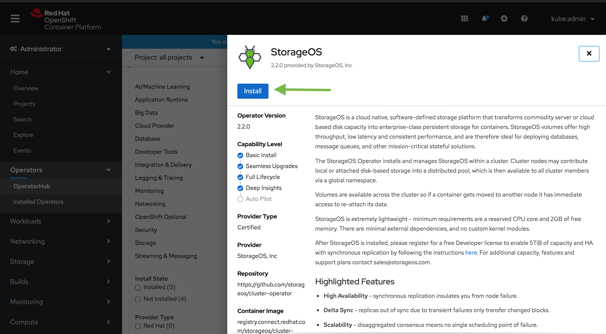

1. Select the install options

    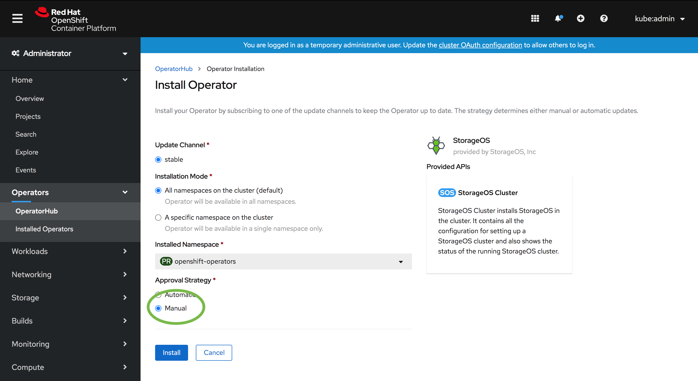

    > Make sure the `Approval Strategy` is set to Manual. So the Ondat
    > Operator doesn't upgrade versions without explicit approval.

1. Start the approval procedure

    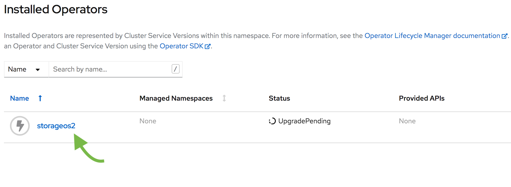

1. Follow the approval link

    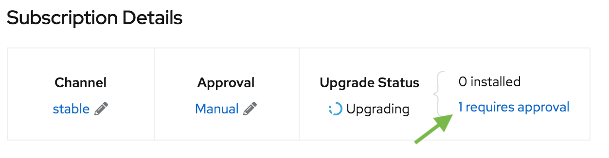

1. Approve the installation

    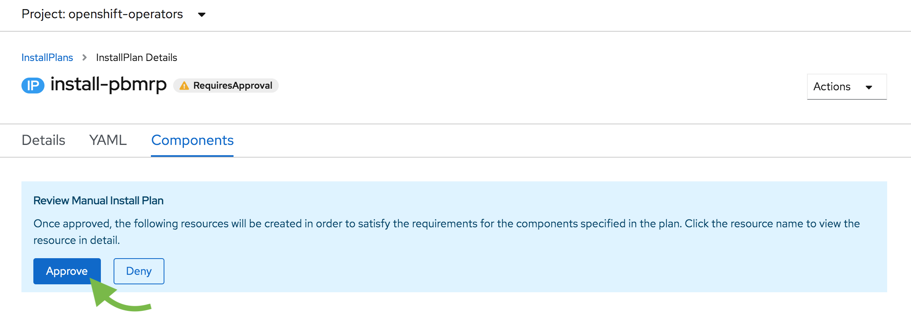

1. The Ondat Cluster Operator is installed along the required CRDs

    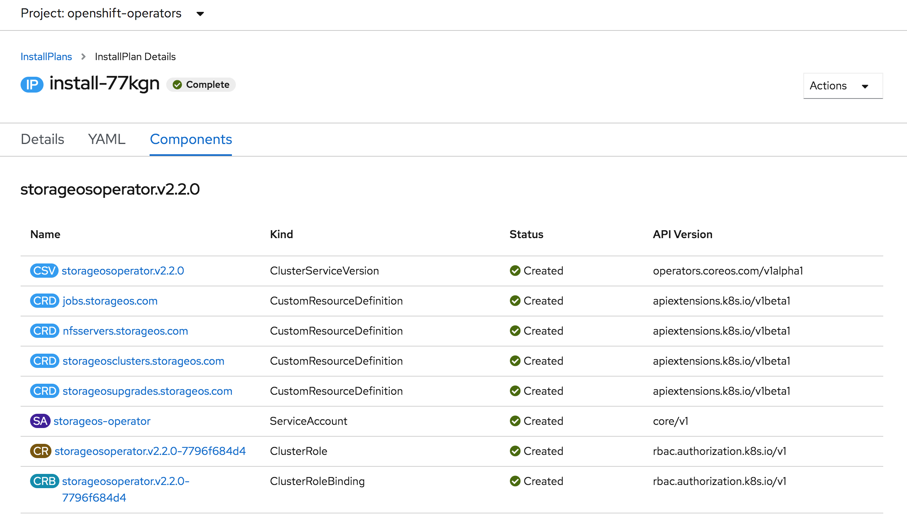

1. Create a Secret in the `openshift-operators` project

    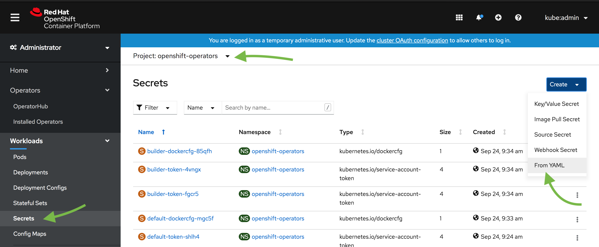

1. Use the YAML options to create a secret containing the `apiUsername` and an
   `apiPassword` key. The username and password defined in the secret will be
   used to authenticate when using the Ondat CLI and GUI. For the
   communication between Ondat and OpenShift, the CSI credentials
   `csiProvisionUsername`, `csiProvisionPassword`,
   `csiControllerPublishUsername`, `csiControllerPublishPassword`,
   `csiNodePublishUsername`, `csiNodePublishPassword` are needed. Take note of
   which project you created the secret in.

    Input the Secret as YAML for simplicity.

    ```yaml
    apiVersion: v1
    kind: Secret
    metadata:
      name: storageos-api
      namespace: openshift-operators
    type: "kubernetes.io/storageos"
    data:
      # echo -n '<secret>' | base64
      apiUsername: c3RvcmFnZW9z
      apiPassword: c3RvcmFnZW9z
      # CSI Credentials
      csiProvisionUsername: c3RvcmFnZW9z
      csiProvisionPassword: c3RvcmFnZW9z
      csiControllerPublishUsername: c3RvcmFnZW9z
      csiControllerPublishPassword: c3RvcmFnZW9z
      csiNodePublishUsername: c3RvcmFnZW9z
      csiNodePublishPassword: c3RvcmFnZW9z
      csiControllerExpandUsername: c3RvcmFnZW9z
      csiControllerExpandPassword: c3RvcmFnZW9z
    ```
    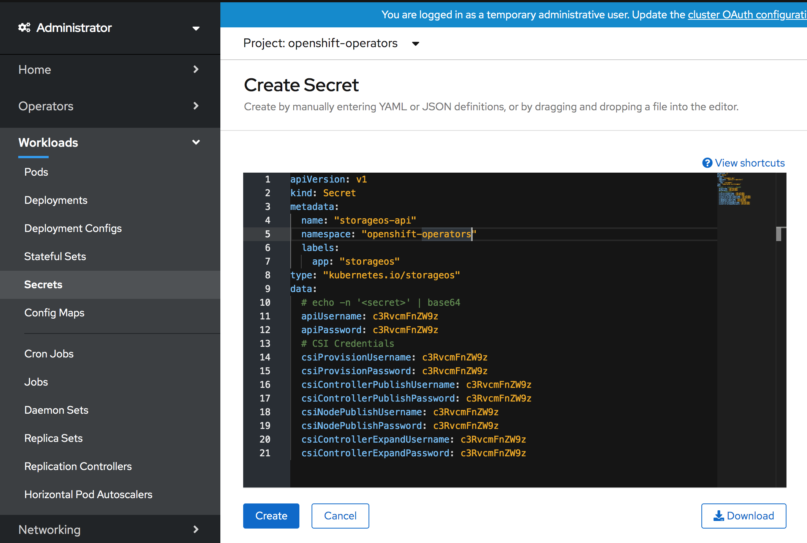

1. Go to the "Installed Operators"

    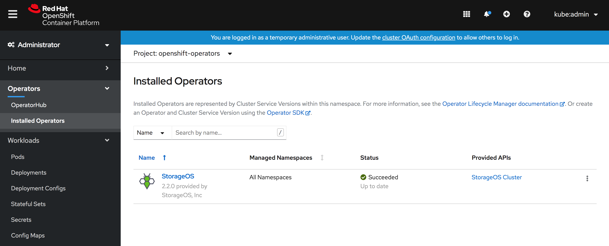

    > Verify that the Ondat Cluster Operator is installed

1. Go to the "Ondat Cluster" section

    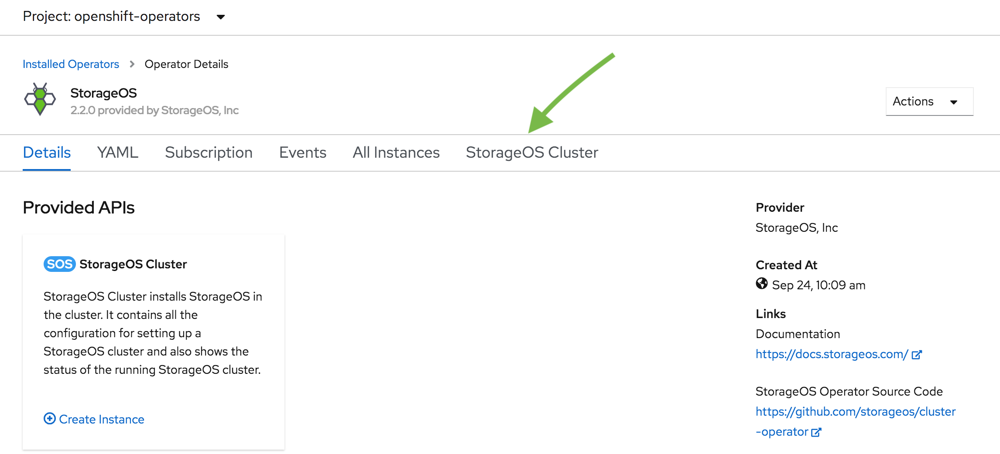


1. Create the Ondat Cluster

    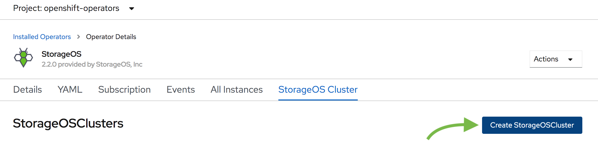

    > A Ondat Cluster is defined using a Custom Resource Definition

1. Create the Custom Resource

   The Ondat cluster resource describes the Ondat cluster that will be
   created. Parameters such as the `secretRefName`, the `secretRefNamespace` and
   the `kvBackend.address` are mandatory.

   Additional `spec` parameters are available on the [Cluster Operator
   configuration](/docs/reference/cluster-operator/configuration) page.

   ```bash
   apiVersion: "storageos.com/v1"
   kind: StorageOSCluster
   metadata:
     name: storageos
     namespace: openshift-operators
   spec:
     # Ondat Pods are in kube-system by default
     secretRefName: "storageos-api" # Reference the Secret created in the previous step
     secretRefNamespace: "openshift-operators"  # Namespace of the Secret created in the previous step
     k8sDistro: "openshift"
     kvBackend:
       address: 'storageos-etcd-client.etcd:2379' # Example address, change for your etcd endpoint
     # address: '10.42.15.23:2379,10.42.12.22:2379,10.42.13.16:2379' # You can set ETCD server ips
     resources:
       requests:
         memory: "512Mi"
         cpu: 1
     # nodeSelectorTerms:
     #   - matchExpressions:
     #     - key: "node-role.kubernetes.io/worker" # Compute node label will vary according to your installation
     #       operator: In
     #       values:
     #       - "true"
   ```

    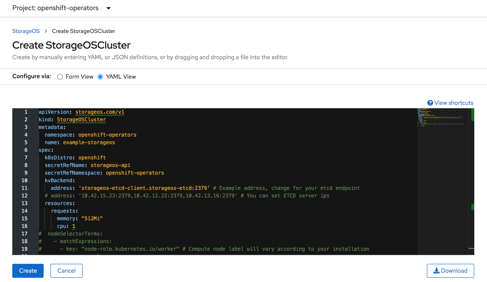

1. Verify that the Ondat Cluster Resource enters a running state.

    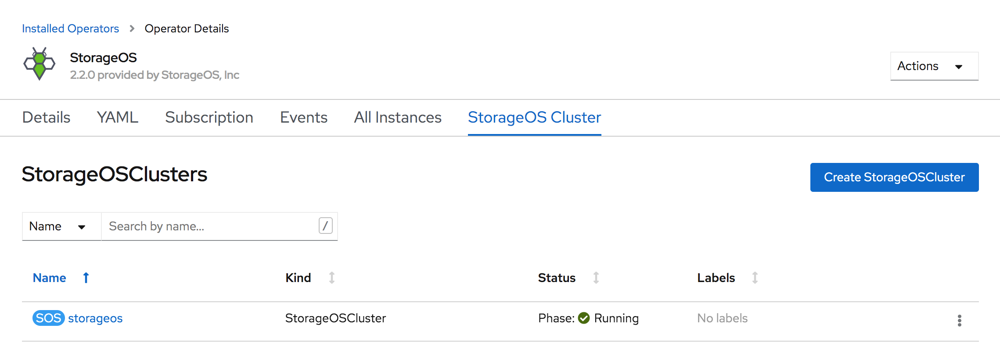

    > It can take up to a minute to report the Ondat Pods ready

1. Check the Ondat Pods in the `kube-system` project

    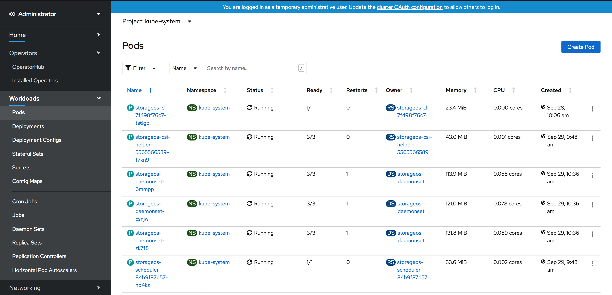

    > A Status of 3/3 for the Daemonset Pods indicates that Ondat is
    > bootstrapped successfully.

1. License cluster

    > A newly installed Ondat cluster does not include a licence. A cluster
    > must be licensed within 24 hours of the installation. For more information,
    > check the [reference licence page]({{ ref . "docs/reference/licence.md" }}).

    You can apply a Free Developer licence following the [operations
    licensing]({{ ref . "docs/operations/licensing.md" }}) page, or purchase a
    licence contacting sales@storageos.com.

{}
{}

# Red Hat Marketplace


{}

{}
{}
# Manual install

{{ $sched_version := .Get "sched_version" }}

The Ondat Cluster Operator is a [Kubernetes native
application](https://kubernetes.io/docs/concepts/extend-kubernetes/extend-cluster/)
developed to deploy and configure Ondat clusters, and assist with
maintenance operations. We recommend its use for standard installations.

The operator is a Kubernetes controller that watches the `StorageOSCluster`
CRD. Once the controller is ready, a Ondat cluster definition can be
created. The operator will deploy a Ondat cluster based on the
configuration specified in the cluster definition.

&nbsp;

**Helm Note:** If you want to use [Helm](https://helm.sh/docs/) to install Ondat, follow
the [Ondat Operator Helm
Chart](https://github.com/storageos/charts/tree/master/stable/storageos-operator#installing-the-chart)
documentation.


## __Steps to install Ondat:__

- [Install Ondat Operator](#1-install-storageos-operator)
- [Create a Secret for default username and password](#2-create-a-secret)
- [Trigger bootstrap using a CustomResource](#3-trigger-a-storageos-installation)
- [Apply Ondat licence](#4-license-cluster)
{{- if ge $sched_version 4.0 }}
- [Set SELinux Permissions](#4-set-selinux-permissions)
{{- end }}

{{ $cmd := .Get "cmd"}}

## 1. Install Ondat operator

Install the Ondat Cluster Operator using the following yaml manifest.

```bash
{{ $cmd }} create -f https://github.com/storageos/cluster-operator/releases/download/{{ .Site.Params.latest_operator_version }}/storageos-operator.yaml
```


### Verify the Cluster Operator Pod Status

```bash
[root@master03]# {{ $cmd }} -n storageos-operator get pod
NAME                                         READY     STATUS    RESTARTS   AGE
storageoscluster-operator-68678798ff-f28zw   1/1       Running   0          3m
```

> The READY 1/1 indicates that `storageoscluster` resources can be created.

## 2. Create a Secret

Before deploying a Ondat cluster, create a Secret defining the Ondat
API Username and Password in base64 encoding.

{{- if (eq (.Get "storageos_version") "2") }}
The API username and password are used to create the default Ondat admin
account which can be used with the Ondat CLI and to login to the Ondat
GUI. The CSI credentials are used to register the CSI accounts, so Kubernetes
and Ondat communicate over an authenticated API.

{{ partial "content/secret-v2.md" . }}

{{- else }}
The API username and password are used to create the default Ondat admin
account which can be used with the Ondat CLI and to login to the Ondat
GUI. The account defined in the secret is also used by Kubernetes to
authenticate against the Ondat API when installing with the native driver.

{{ partial "content/secret-v1.md" . }}

{{- end }}


This example contains a default password, for production installations, use a
unique, strong password.

> You can define a base64 value by `echo -n "mystring" | base64`.

> Make sure that the encoding of the credentials doesn't have special characters such as '\n'.
> The `echo -n` ensures that a trailing new line is not appended to the string.

> If you wish to change the default accounts details post-install please see [Managing
> Users](/docs/operations/users#altering-the-storageos-api-account)

{{ $cmd := .Get "cmd"}}
{{ $platforms := split ( .Get "platforms" ) "," }}
{{ $sched_version := .Get "sched_version" }}

## 3 Trigger a Ondat installation

{{ if eq (len $platforms) 1 }}
    {{- partial "content/customresource-v2.md" (dict "params" $.Params "platform" ( index  $platforms 0 )) -}}
{{ else }}
    {{ partial "content/operator-cr-tabs-v2.html" . }}
{{ end }}

> Additional `spec` parameters are available on the [Cluster Operator
> configuration]( {{ ref . "docs/reference/cluster-operator/configuration.md" }})
> page.

> You can find more examples such as deployments referencing a external etcd kv
> store for Ondat in the [Cluster Operator examples](
> {{ ref . "docs/reference/cluster-operator/examples.md" }}) page.

### Verify Ondat Installation

```bash
[root@master03]# {{ $cmd }} -n kube-system get pods -w
NAME                                    READY   STATUS    RESTARTS   AGE
storageos-csi-helper-5cf59b5b4-f5nwr    2/2     Running   0          3m
storageos-daemonset-75f6c               3/3     Running   0          3m
storageos-daemonset-czbqx               3/3     Running   0          3m
storageos-daemonset-zv4tq               3/3     Running   0          3m
storageos-scheduler-6d67b46f67-5c46j    1/1     Running   0          3m
```

> The above command watches the Pods created by the Cluster Definition example.
> Note that pods typically take approximately 65 seconds to enter the Running
> Phase.

## 4. License cluster

Newly installed Ondat clusters must be licensed within 24 hours. Our
developer license is free, and supports up to 5TiB of provisioned storage.

To obtain a license, follow the instructions on our [licensing operations](..//operations/licensing.md) page.


{}


## First Ondat volume

If this is your first installation you may wish to follow the [Ondat volume guide](../operations/firstpvc.md) for an example of how
to mount a Ondat volume in a Pod.
