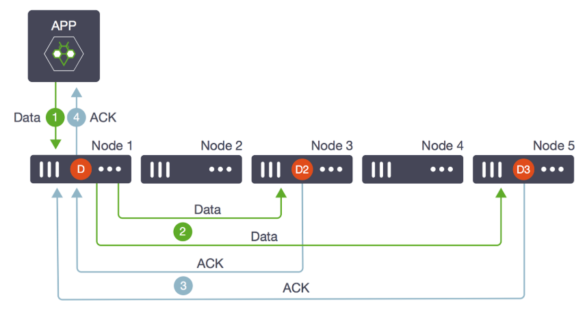

# Replication

Ondat replicates volumes across nodes for data protection and high
availability. Synchronous replication ensures strong consistency for
applications such as databases and Elasticsearch, incurring one network round
trip on writes.

The basic model for Ondat replication is of a master volume with distributed
replicas. Each volume can be replicated between 0 and 5 times, which are
provisioned to 0 to 5 nodes, up to the number of remaining nodes in the cluster.

In this diagram, the master volume `D` was created on node 1, and two replicas,
`D2` and `D3` on nodes 3 and 5.

Writes that come into `D` (step 1) are written in parallel to `D2` and `D3`
(step 2). When both replicas and the master acknowledge that the data has been
written (step 3), the write operation return successfully to the application
(step 4).

For most applications, one replica is sufficient (`storageos.com/replicas=1`).

All replication traffic on the wire is compressed using the lz4 algorithm, then
streamed over tcp/ip to target port tcp/5703.

If the master volume is lost, a replica is promoted to master (`D2` or `D3`
above) and a new replica is created and synced on an available node (Node 2 or
4). This is transparent to the application and does not cause downtime.

If a replica volume is lost and there are enough remaining nodes, a new replica
is created and synced on an available node. While a new replica is created and
being synced, the volume's health will be marked as degraded.

If the lost replica comes back online before the new replica has finished
synchronizing, then Ondat will calculate which of the two synchronizing
replicas has the smallest difference compared to the master volume and keep
that replica. The same holds true if a master volume is lost and a replica is
promoted to be the new master. If possible, a new replica will be created and
begin to sync. Should the former master come back online it will be demoted to
a replica and the replica will the smallest difference to the current master
will be kept.

While the replica count is controllable on a per-volume basis, some
environments may prefer to set [default labels on the StorageClass](../reference/labels.md#storageos-storageclass-labels).

## Delta Sync

Ondat implements a delta sync between a volume master and its replicas.
This means that if a replica for a volume goes offline, that when the replica
comes back online only the regions with changed blocks need to be synchronized.
This optimization reduces the time it takes for replicas to catch up, improving
volume resilience. Additionally, it reduces network and IO bandwidth which can
reduce costs when running in public clouds.

## Topology-Aware Placement

Ondat Topology-Aware Placement is a feature that enforces placement of data
across failure domains to guarantee high availability.

TAP uses default labels on nodes to define failure domains. For instance, an
Availability Zone. For more detail on TAP, check the 
[reference page](../reference/tap.md).

{}

For details about how to use the labels on the VolumesCheck, see the [failure modes operations](../operations/failure-modes.md") page.
