# Rancher

Ondat is a certified Rancher application. We offer two installation
methods:

* Rancher Catalogue - this is the easiest and requires just a few clicks
* Manual - allowing more control and visibility

Before proceeding, ensure that you have followed our [prerequisites](../prerequisites/_index.md). 
On Rancher, pay particular attention to
the OS version and image used - some platforms require extra mainline kernel
modules to be enabled.

{{< tabs tabTotal="2" tabID="1" tabHREFPrefix="" tabName1="Catalog" tabName2="Manual
{}

# Catalog Install

Ondat is a Certified application in the [Rancher
Catalog](https://rancher.com/docs/rancher/v2.x/en/catalog/). You can install
Ondat using the Rancher application install.

Before completing the steps below, you will need an etcd cluster. For
evaluation use our simple [test](../prerequisites/etcd.md#testing) recipe. 
For production installations, follow our [production](../prerequisites/etcd.md#production) recipe. 
Make a note of the etcd endpoint URL in either case.

1. Select the `System` project of your cluster

    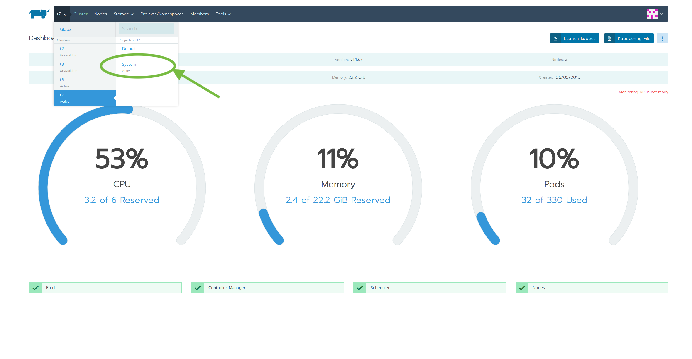

2. Select the `Apps` tab and click `Launch`

    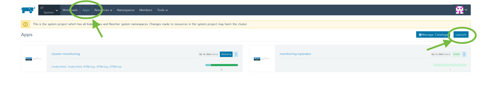

3. Search for Ondat and click on the App

    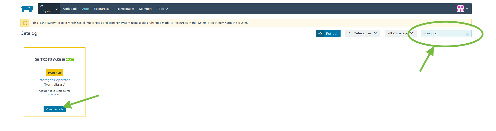

    This will install the Ondat operator, which manages the Ondat
    DaemonSet.

4. Check and ammend installation options

    A generic configuration for Ondat is preset using the default values in
    the form. Be sure to check the etcd address and ensure it matches the value
    you noted at the beginning of this guide.

    The catalog form exposes several useful parameters - documented
    [below](../install/rancher.md#simplecustomization}).

    For further customization, you can opt to set the option to 'Install
    Ondat Cluster' to false and install a custom CR. See [below](../install/rancher.md#advancedcustomization) for this.


    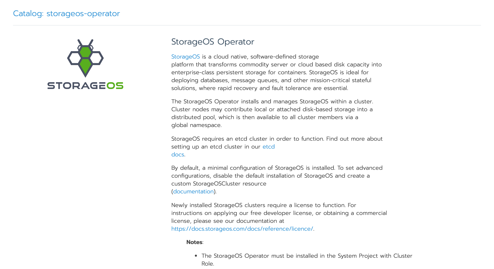

5. Launch the Ondat cluster

    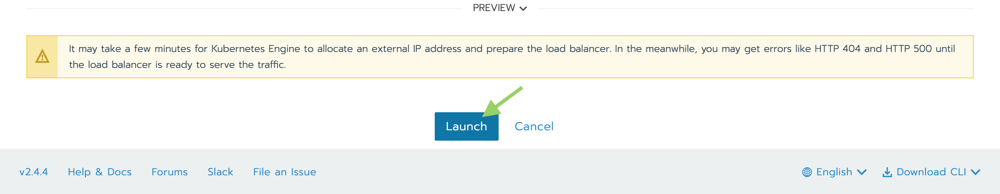

6. Verify the cluster bootstrap has successfully completed

    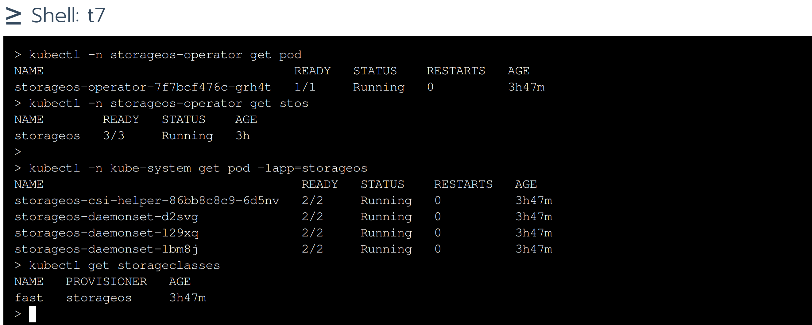

7. License the newly installed cluster

    Newly installed Ondat clusters must be licensed within 24 hours. Our
    personal license is free, and supports up to 1TiB of provisioned storage.

    You will need access to the Ondat API on port 5705 of any of your nodes.
    For convenience, it is often easiest to port forward the service using the
    following kubectl incantation (this will block, so a second terminal window may
    be advisable):

      ```bash
      $ kubectl port-forward -n storageos svc/storageos 5705
      ```
    Now follow the instructions on our [licensing operations](../operations/licensing.md) 
    page to obtain and apply a license.

    Installation of Ondat is now complete.

## <a name='simplecustomization'></a>Simple Customization - Modify Catalog Form

The following options are exposed by the catalog form to allow some simple
customization of the Ondat installation.

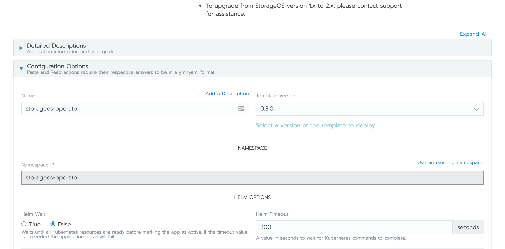
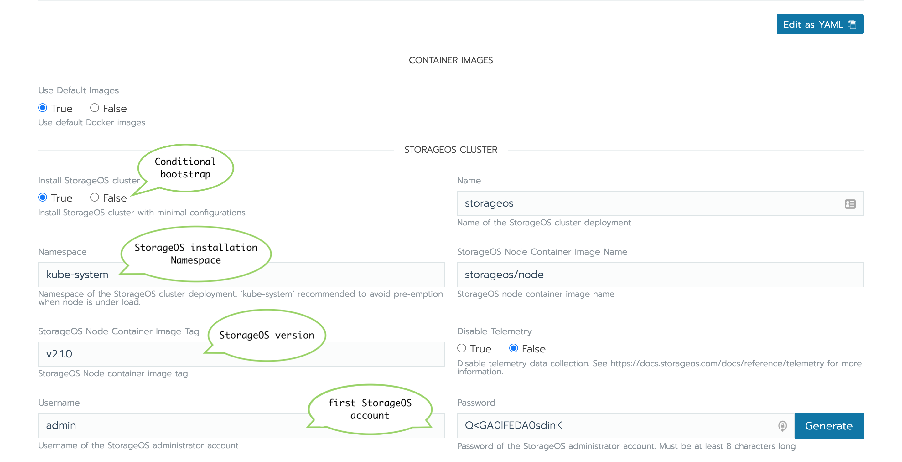
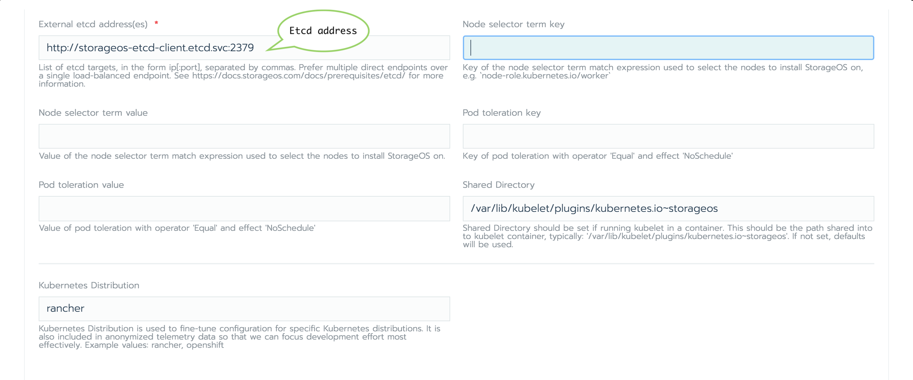

* **Cluster Operator namespace**
: The Kubernetes namespace where the [Ondat Cluster Operator](../reference/cluster-operator/_index.md) and other resources will be
created.
* **Container Images** : By default images are pulled from DockerHub, you can
* specify the image URLs
when using private registries.
* **Install Ondat cluster** 
: Controls the automatic deployment of Ondat after installing the Cluster
Operator. If set to `false`, the Operator will be created, but a Custom Resource will
not be applied to the cluster. Launch the operator and proceed to the section
[Advanced Customization](../install/rancher.md#advancedcustomization) below.
* **Namespace** : The Kubernetes namespace where Ondat will be
installed. By default, Ondat installs into the `storageos` namespace,
which will add a priority class to ensure high priority resource allocation.
Installing Ondat with the priority class prevents Ondat from being
evicted during periods of resource contention. It is inadvisable to modify this
under normal circumstances.
* **Username/Password** : Default Username and Password for the admin account
to be created at Ondat bootstrap. A random password will be generated by
leaving the field empty or clicking the `Generate` button.
* **External etcd address(es)** : Connection and configuration details for an
external Etcd cluster.See our documentation [here](../prerequisites/etcd.md).
* **Node Selectors and Tolerations**
: Control placement of Ondat DaemonSet Pods. Ondat will only be
installed on the selected nodes.
* **Tolerations** : Define any tolerations you wish the DaemonSet to observe.

## <a name='advancedcustomization'></a>Advanced Customization - Apply Custom CR

If `Install Ondat Cluster` was set to `false`, Ondat will not be
bootstrapped automatically. After the Ondat Operator is installed, you can
now create a Custom Resource that describes the Ondat cluster.

1. Select the `System Workloads` and `Import YAML`
    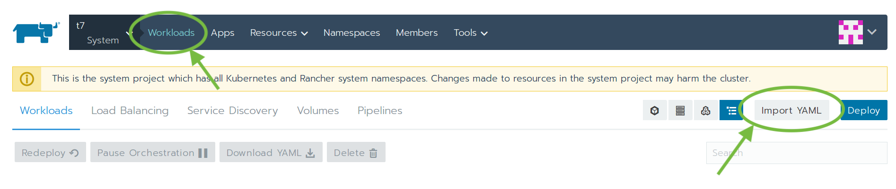

1. Create the `Secret` and `CustomResource`
    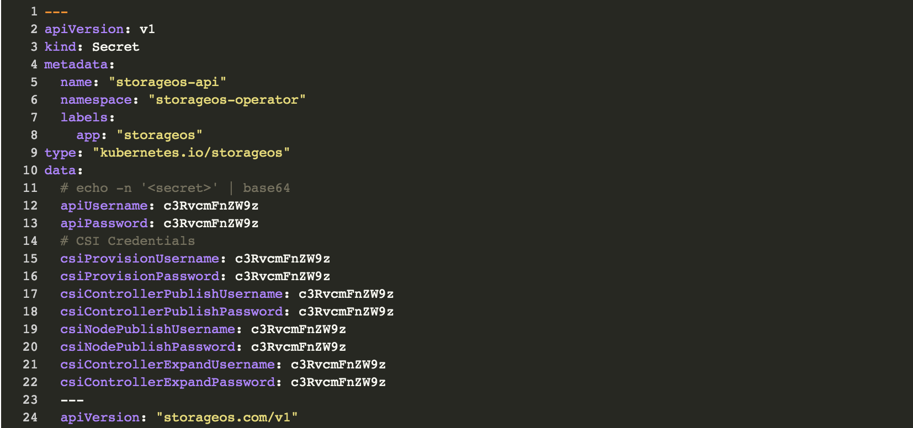
    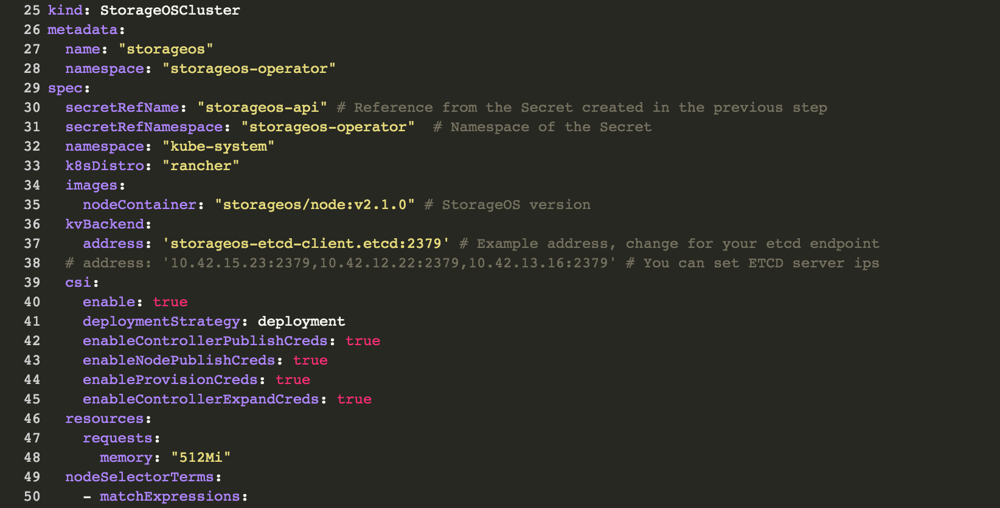
    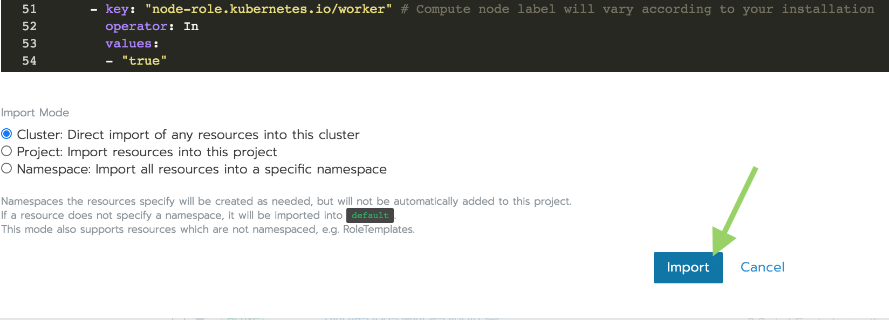

    This is an example.

    ```bash
    ---
    apiVersion: v1
    kind: Secret
    metadata:
      name: "storageos-api"
      labels:
        app: "storageos"
    type: "kubernetes.io/storageos"
    data:
      # echo -n '<secret>' | base64
      username: c3RvcmFnZW9z
      password: c3RvcmFnZW9z
    ---
    apiVersion: "storageos.com/v1"
    kind: StorageOSCluster
    metadata:
      name: "storageos"
    spec:
      # Ondat Pods are in storageos NS by default
      secretRefName: "storageos-api" # Reference from the Secret created in the previous step
      k8sDistro: "rancher"
      storageClassName: "ondat" # The storage class created by the Ondat operator is configurable
      images:
        nodeContainer: "storageos/node:" # Ondat version
      kvBackend:
        address: 'storageos-etcd-client.etcd:2379' # Example address, change for your etcd endpoint
      # address: '10.42.15.23:2379,10.42.12.22:2379,10.42.13.16:2379' # You can set ETCD server ips
      sharedDir: '/var/lib/kubelet/plugins/kubernetes.io~storageos' # Needed when Kubelet as a container
      resources:
        requests:
          memory: "512Mi"
      nodeSelectorTerms:
        - matchExpressions:
          - key: "node-role.kubernetes.io/worker" # Compute node label will vary according to your installation
            operator: In
            values:
            - "true"
    ```
    > Additional `spec` parameters are available on the [Cluster Operator
    > configuration](../reference/cluster-operator/configuration.md) page.

    > You can find more examples such as deployments referencing a external
    > etcd kv store for Ondat in the [Cluster Operator examples](../reference/cluster-operator/examples.md) page.


{}
{}

# Manual Installation
{}
{}

For more details on the installation options, check the [kubectl storageos plugin reference page](../reference/kubectl-plugin).

{}
{}

{}


{}
